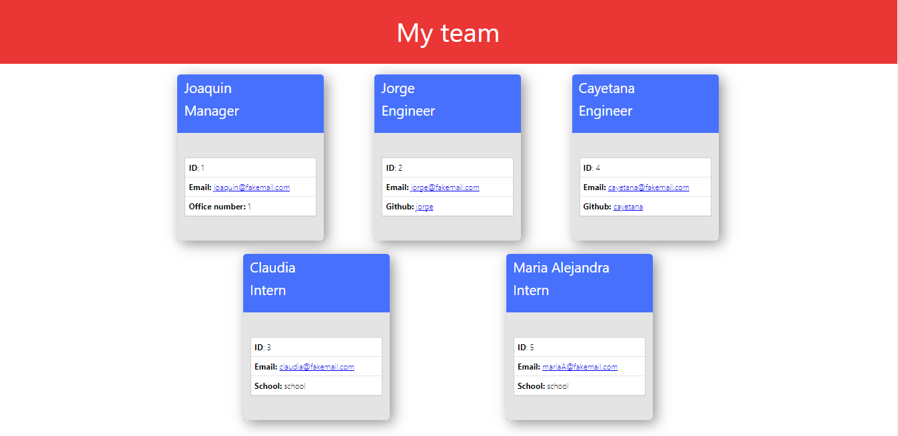

# My team 

[](https://opensource.org/licenses/ISC)

# Project Description

This project is used to generate an html with cards for each member of your team. You are going to be able to assign to each member their respective role as manager, engineer, or intern.

when creating the team the user can add as much engineers and interns needed to form their team but can only have one manager per team

each genearated card will have the name, role, id, and email by default but depending on the role other filds will be added the Manager will have an office number fild, the Engineer will have a github username fild and the Intern will have a school fild

# Example img of html



# Pre-requisites
- Install [Node.js](https://nodejs.org/en/)

# Getting Started

* Install dependencies
```
    npm i
```
* Run the project
```
    node index.js
```
* walkthrough video: https://drive.google.com/file/d/1sVYzO6-3SQqo-kS0MoQ0Yezo98WLTEO1/view

# Questions

email: gomezjoaquin991@gmail.com

github: [joacogm12](https://github.com/joacogm12)


# License

Licensed under the [ISC](https://chooseaLicense.com/licenses/isc/) license

    